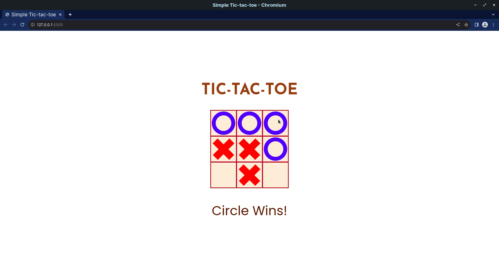
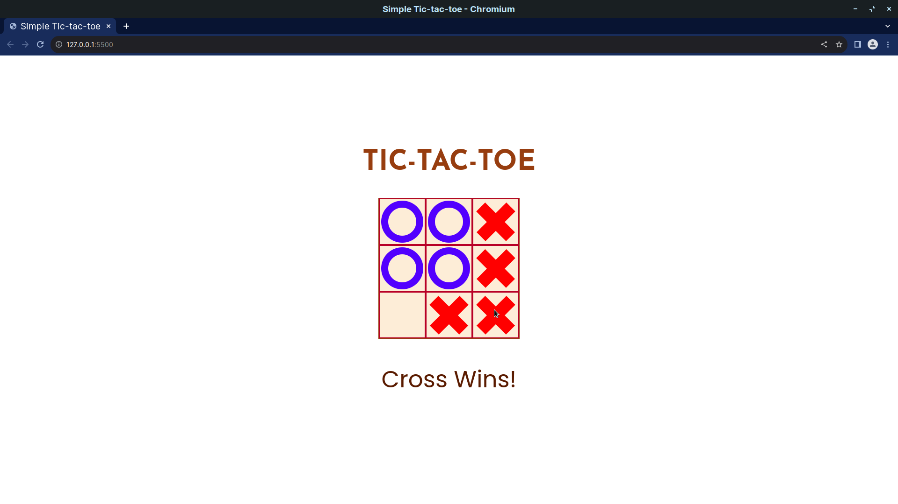
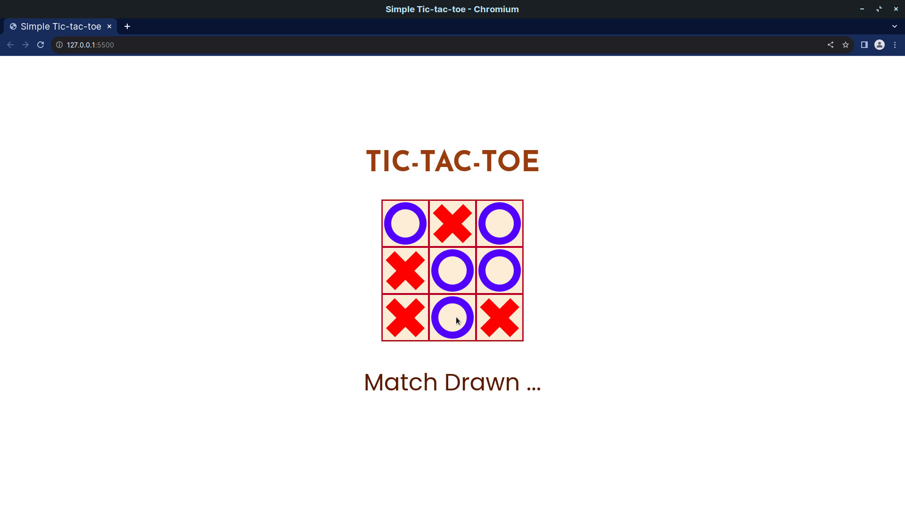

# Simple Tic-Tac-Toe

This is a simple Tic-Tac-Toe game developed using *Vanilla Javascript*.

This is not my brainchild. I followed a [tutorial](https://www.youtube.com/watch?v=DRaWr0Dcbl0) by [Ania Kubow](https://www.youtube.com/@AniaKubow).

I just added the "Match-drawn" (or stalemate) feature.
 
 

## The Screenshots
 

### Circle Wins

 
 

### Cross Wins 

 
 

### Match Tied 

 
 

---